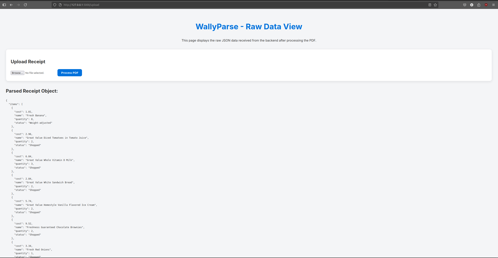

# Expense Splitter

An AI-powered web application to parse PDF receipts and split expenses among multiple people.

## Features

  * **AI PDF Parsing**: Uses the Google Gemini API to automatically extract line items and summary totals from a PDF receipt (Tested only on walmart recipets).
  * **Interactive Splitting**: A web interface to assign shares for each item to different people.
  * **Automatic Calculations**: Dynamically calculates and distributes the subtotal, tax, and tip based on each person's share.

## How to Run

1.  **Clone the repository:**

    ```bash
    git clone https://github.com/dhinesh-babu/expense-splitter.git
    cd expense-splitter
    ```

2.  **Create a virtual environment and install dependencies:**

    ```bash
    python -m venv venv
    source venv/bin/activate  # On Windows: venv\Scripts\activate
    pip install -r requirments.txt
    ```

3.  **Set API Key:**

      * Create a `.env` file in the root directory.
      * Add your Google Gemini API key: `GEMINI_API_KEY="YOUR_API_KEY"`

4.  **Run the application:**

    ```bash
    python main.py
    ```

    The application will be available at `http://127.0.0.1:5000`.

## Technologies Used

  * **Backend**: Python, Flask
  * **Frontend**: HTML, CSS, JavaScript
  * **AI**: Google Gemini API
  * **Dependencies**: Pydantic, Werkzeug